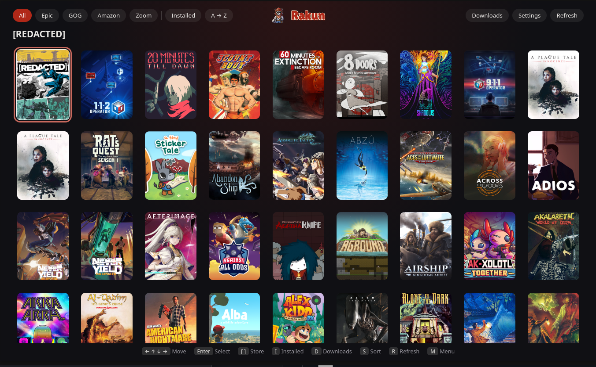
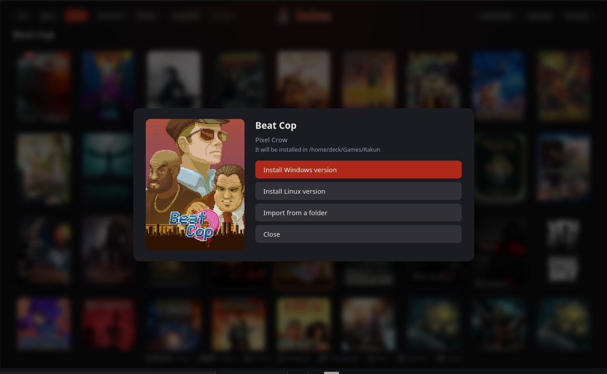

# rakun


[English](README.md)

**rakun instala tus juegos de PC en Linux y los pone en Steam.** Inicia sesión en Epic Games, GOG, Amazon Games o Zoom Platform, elige un juego y, cuando termina la descarga, aparece en tu biblioteca de Steam listo para jugar. Nació pensando en la Steam Deck, pero funciona en cualquier Linux con Steam.

rakun **no es un lanzador**. Nunca ejecuta tus juegos: lo hace Steam. Lo suyo es todo lo anterior: iniciar sesión, descargar, actualizar, reparar, desinstalar y conectar el juego con Steam.



**rakun es un backend.** Es un pequeño servicio sin ventana propia, y su interfaz es una página web que sirve él mismo. Cualquier navegador es un cliente: ábrela en la misma máquina o (cuando lo permites, ver [Configuration](docs/Configuration.md#web-access), en inglés) desde tu móvil u otro ordenador de tu red doméstica, elige un juego y rakun lo instala en la máquina que tiene Steam. También hay `rakunctl` para la terminal y la [API HTTP](API.md) para tus propios clientes.

## Qué hace

- Inicia sesión en **Epic, GOG, Amazon y Zoom** (pegas el código en el que acaba tu navegador; no hay navegador embebido)
- Muestra tu **biblioteca** y una **cola de descargas** que puedes pausar, reanudar y cancelar
- **Instala, actualiza, repara y desinstala** juegos, elige la versión de Windows o Linux y puede adoptar un juego que ya está en tu disco
- Añade cada juego a **Steam** (acceso directo, prefijo de Proton, carátulas) al terminar la instalación
- Incluye una **página web** (biblioteca, descargas, cuentas) y una **línea de comandos**, `rakunctl`

## Cómo funciona

rakun es un pequeño servicio en segundo plano, sin ventana. Hablas con él desde un navegador o desde la terminal.

```
 navegador (web) ┐
 rakunctl ───────┼──► rakun ──► herramientas de las tiendas (legendary, gogdl, nile…) ──► tus juegos
 otros clientes ─┘      │
                        └────► Steam (acceso directo, prefijo, carátulas)
```

Todo pasa por una API HTTP local en `127.0.0.1:17370`, protegida con un token. Ver [API.md](API.md).

## En qué se basa

rakun es un fork de [Relic](https://github.com/FranjeGueje/Relic), que a su vez es un fork solo para Linux de [Heroic Games Launcher](https://github.com/Heroic-Games-Launcher/HeroicGamesLauncher) (Heroic → Relic → rakun). Se quitó la ventana de Electron de Heroic y se conserva la parte que habla con las tiendas. Quien descarga de verdad son herramientas de código abierto que rakun ejecuta por ti: [Legendary](https://github.com/derrod/legendary) (Epic), [GOGdl](https://github.com/Heroic-Games-Launcher/heroic-gogdl) y [Comet](https://github.com/imLinguin/comet) (GOG), [Nile](https://github.com/imLinguin/nile) (Amazon) y [umu-launcher](https://github.com/Open-Wine-Components/umu-launcher) (prefijos de Proton).

**Tecnología:** Node.js 24 y TypeScript, empaquetados con esbuild; una web en React; Jest para las pruebas; pnpm. Sin Electron, sin Chromium y casi sin dependencias en tiempo de ejecución.

## Instalar

Instalación rápida de la última versión (x64, bash):

```bash
V=$(curl -fsSLI -o /dev/null -w '%{url_effective}' https://github.com/FranjeGueje/rakun/releases/latest); V=${V##*/}; curl -fsSL https://raw.githubusercontent.com/FranjeGueje/rakun/$V/scripts/install.sh | bash -s -- https://github.com/FranjeGueje/rakun/releases/download/$V/rakun-${V#v}-linux-x64.tar.gz
```

O compílala tú (ver [Compilar](#compilar)) e instálala:

```bash
pnpm package          # crea dist/rakun-<versión>-linux-<arq>.tar.gz
scripts/install.sh    # la instala en ~/.local/opt/rakun y enlaza rakun y rakunctl
```

El paquete lleva su propio Node, así que en SteamOS no hace falta nada más.

## Primeros pasos

```bash
rakunctl start                # arranca rakun en segundo plano
rakunctl helpers update       # descarga las herramientas de las tiendas (una vez)
rakunctl login gog            # o epic, amazon, zoom
rakunctl library gog          # mira tus juegos
rakunctl install gog <nombre> # instala uno: aparece en Steam
```

Para actualizar rakun más adelante: `rakunctl self-update` (`--check` solo dice si hay una versión nueva). Mira la [wiki](docs/Getting-Started.md#updating-rakun).

¿Prefieres el ratón? Abre **http://127.0.0.1:17370** en un navegador de la misma máquina.



Para juegos de Windows, instala [GE-Proton](https://github.com/GloriousEggroll/proton-ge-custom) y, una vez por juego, elígelo en las propiedades del juego en Steam → Compatibilidad. Los instaladores de Windows de Zoom necesitan una sesión de escritorio.

## Compilar

Necesitas Node.js 24 o superior, [pnpm](https://pnpm.io), git, `curl` y `unzip`.

```bash
git clone https://github.com/FranjeGueje/rakun.git && cd rakun
pnpm install
pnpm build            # build/rakun.cjs, build/rakunctl.cjs y build/web/
pnpm start            # ejecútalo directamente desde el código
pnpm test             # lanza las pruebas
pnpm package          # tarballs en dist/ (--full incluye también las herramientas de las tiendas)
```

Más en [Development](docs/Development.md).

## Conviene saber

- Por defecto solo tu propia máquina puede abrir la web. `--web network` la abre a toda tu red **sin ninguna protección**: úsalo solo en casa y nunca expuesto a Internet.
- rakun guarda sus ficheros en `~/.config/rakun`, `~/.local/share/rakun` y `~/Games/Rakun`, y no comparte nada con Relic. Ver [File locations](docs/File-Locations.md).
- rakun no tiene traducciones; sus mensajes están en inglés.

## Documentación

La [wiki](docs/Home.md) tiene el resto (en inglés):

- [Getting started](docs/Getting-Started.md) · [User guide](docs/User-Guide.md) · [Commands](docs/Commands.md)
- [Configuration](docs/Configuration.md) · [Helper binaries](docs/Helper-Binaries.md) · [Troubleshooting](docs/Troubleshooting.md)
- [Steam integration](docs/Steam-Integration.md) · [Architecture](docs/Architecture.md) · [API](API.md)
- [Registro de cambios](CHANGELOG.md)

## Créditos

Gracias a todas las personas de [AUTHORS](AUTHORS), a los proyectos Relic y Heroic y a los autores de las herramientas anteriores. El rótulo «Rakun» de la web está dibujado a partir de [Lilita One](https://github.com/google/fonts/tree/main/ofl/lilitaone) de Juan Montoreano (SIL Open Font License 1.1, `web/LilitaOne-OFL.txt`).

## Licencia

[GPL-3.0-only](COPYING)
