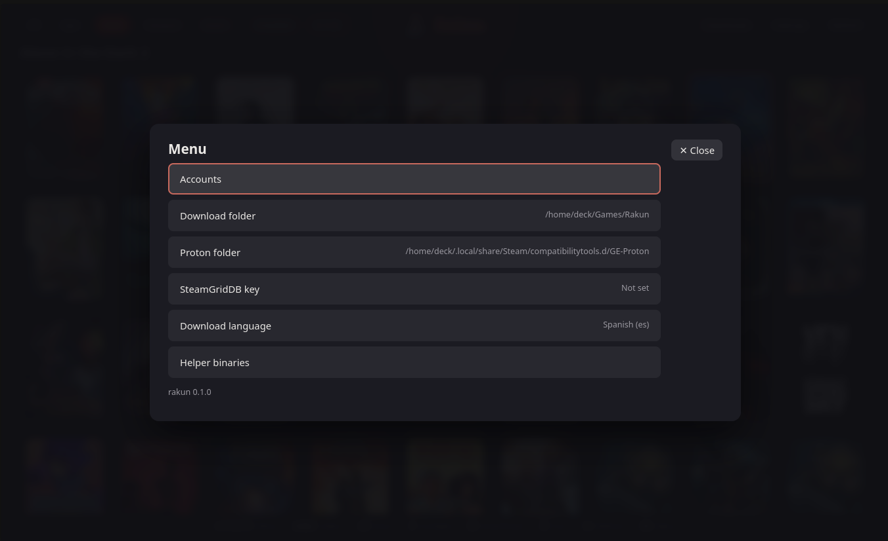

# Configuration

```bash
rakunctl config                       # list every setting
rakunctl config protonPath            # read one
rakunctl config protonPath <folder>   # change one
```

Values are validated by rakun before they are saved; a wrong one is refused with the reason. The web has a menu with the main ones (download and Proton folders, SteamGridDB key, language), and the version of rakun at the end:



## Settings

| Setting                                        | Default                 | Meaning                                                                                 |
| ---------------------------------------------- | ----------------------- | --------------------------------------------------------------------------------------- |
| `defaultInstallPath`                           | `~/Games/Rakun`         | Where games are installed (absolute path)                                               |
| `protonPath`                                   | first `*proton*` folder | GE-Proton used to prepare prefixes. Empty = automatic. Must contain the `proton` script |
| `language`                                     | `en`                    | Default install language **for GOG** only. rakun itself has no translations             |
| `maxWorkers`                                   | `0`                     | Download workers; `0` lets the store tools decide. Integer up to your CPU count         |
| `autoUpdateGames`                              | `true`                  | Update games automatically                                                              |
| `steamGridDbApiKey`                            | empty                   | Key for the covers, see [User guide](User-Guide.md#steam-covers)                        |
| `defaultSteamPath`                             | `~/.steam/steam`        | Steam folder rakun reads (`userdata`) when it adds a game to Steam                      |
| `webAccess`                                    | `local`                 | Who can open the web, see below. Applies **when rakun restarts**                        |
| `altLegendaryBin`, `altGogdlBin`, `altNileBin` | empty                   | Use another helper program instead of the downloaded one (empty or an existing file)    |

`rakunctl config` shows the complete list for your version.

## Web access

| Mode              | How                                                     | What happens                                     |
| ----------------- | ------------------------------------------------------- | ------------------------------------------------ |
| `local` (default) | nothing                                                 | only this machine can open the web               |
| `network`         | `rakunctl start --web network` or `rakun --web=network` | the whole network, **without any protection**    |
| `off`             | `--web off`                                             | no page is served; the API stays on this machine |

Priority: the `--web` / `--port` flag, then `RAKUN_WEB` / `RAKUN_PORT`, then the saved setting.

> [!CAUTION]
> `network` has **no protection**. It is meant for home use on a network you trust: anyone who can reach the port controls rakun. Do not expose that port to the Internet.

Even so, settings, folder listing, logs and a few more channels still only answer to the machine itself. The full rules are in [API](../API.md#who-can-open-the-web-webaccess).

## Environment variables

| Variable            | Used by         | Meaning                                     |
| ------------------- | --------------- | ------------------------------------------- |
| `RAKUN_PORT`        | rakun           | API port (default `17370`)                  |
| `RAKUN_WEB`         | rakun           | `local`, `network` or `off`                 |
| `RAKUN_WEB_DIR`     | rakun           | Serve the web from another folder           |
| `RAKUN_API_FILE`    | rakunctl, smoke | Read port and token from another `api.json` |
| `RAKUN_NODE_BINARY` | `package.sh`    | Use this Node instead of downloading one    |

The port and the token live in `~/.config/rakun/api.json` (mode 0600).

## Language

rakun has no translations: its messages are in English. The `language` setting only chooses the language GOG installs by default (`rakunctl config language es`), and applies at once.

---

Next: [Helper binaries](Helper-Binaries.md) · [File locations](File-Locations.md)
